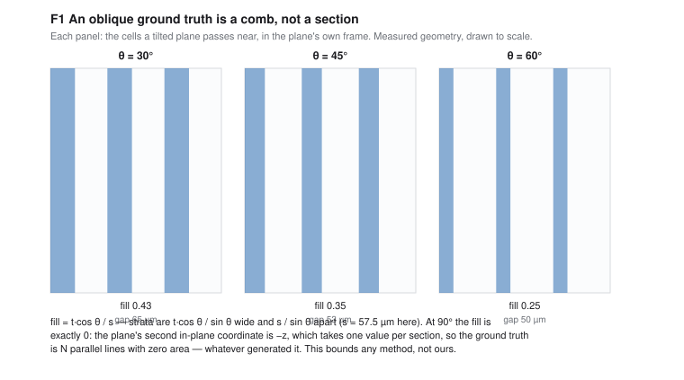
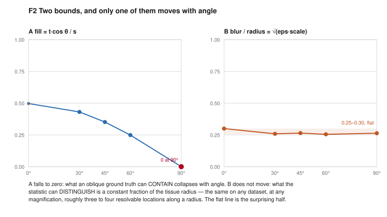
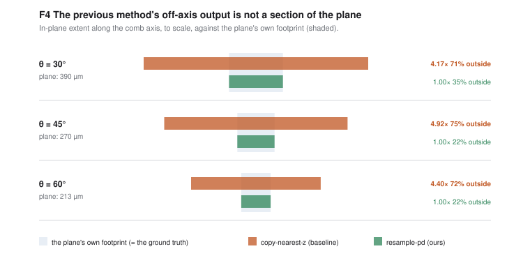
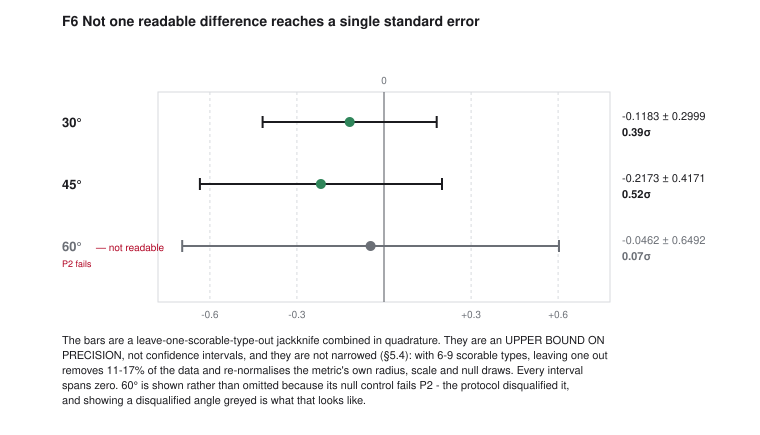
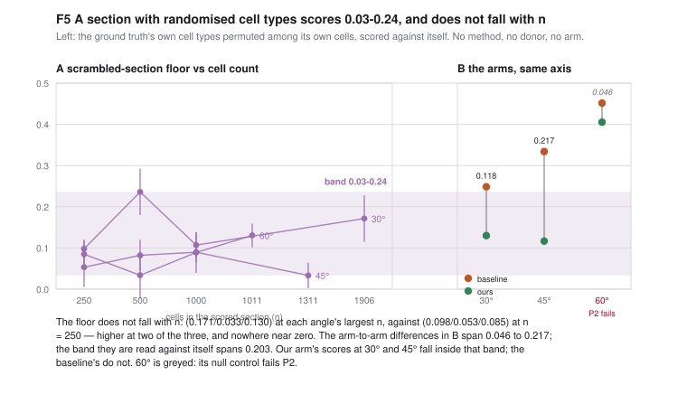

# SpatialCPA-v25-Gen: section generation at an arbitrary plane, and the limits of evaluating it

*Full draft. Every number is measured and sourced; the provenance of each is in `reports/`.*
*Figures are in `paper/figures/`, drawn from committed JSON by `scripts/make_figures.py`; `paper/FIGURES.md` is the figure list, including the one deliberate omission.*

---

# 1. Introduction

Three-dimensional spatial transcriptomics is published as a stack of serial sections: a specimen is
cut along one axis, each slice is imaged, and the volume is reconstructed by registering the slices
back together. Every method that generates a "missing section" therefore generates one **parallel to
the cutting plane**, because that is the only orientation in which a ground truth exists.

This is a real limitation on what such models can be asked for. A volume reconstructed from coronal
slices cannot be queried sagittally; a model that interpolates between sections cannot be asked for a
plane through a structure at the angle an anatomist would choose. The obstacle is not the generative
model — it is that the standard formulation has no answer for a plane that is not one of the slices.
The dominant layout rule selects a donor by `|Δz|`, a quantity that names nothing for a plane
spanning the stack, and then copies that donor's whole face.

**We make section generation well-defined at an arbitrary plane** by carrying the volume as a
continuous field — a correlated 3D noise prior, an anatomical field with retrieval, and heads that
are queried at coordinates rather than at section indices (§2). A plane is then just a set of
coordinates, and the question "what is the section here?" has an answer at any position and any
orientation.

**And then we could not demonstrate that it helps.** That is the substance of this paper, and it is
worth saying at the outset what happened, because the reason is more useful than the result would
have been.

## What we found

Setting out to score an obliquely-oriented generated section against a real one, we found that the
evaluation itself is bounded in three independent ways, none of them previously stated, and all three
computable from published constants and a coordinate file:

1. **The comb limit.** There is no obliquely-cut section in any dataset we know of, so an oblique
   ground truth must be assembled from the cells a tilted plane passes near. That assembly is a set
   of `N` strata covering `fill = t·cos θ / s` of the plane, and at 90° it is `N` lines with zero
   area. **This bounds what any method can be scored against on serial sections** (§3.1).
2. **The metric's resolution.** The standard localisation statistic transports under a Gaussian whose
   width is a fixed fraction of the tissue radius — `√(eps·scale) ≈ 0.26–0.30`, dimensionless, the
   same on any dataset at any magnification. It distinguishes **three to four locations along a
   radius** (§3.2).
3. **The scrambled-section floor.** A section whose cell types are randomly permuted *among its own
   cells* — no method, no donor — scores **0.03–0.24** on that statistic, and this does not fall with
   cell count. **Any difference below roughly 0.2 is inside the range a section carrying no type
   information at all can reach** (§5.6).

They also say that most specimens cannot be evaluated obliquely at all. Across every built dataset we
could read, **three of four stop at 5°** — a tilt that is, on a 21.6 : 1 slab, a coronal section —
and the fourth reaches **60°**. What separates it is not size or shape but **depth**: it is a 200 µm
block cut into slabs, where the others are stacks of thin sections (§4.4).

Together these say that an oblique evaluation on serial-section data is not powered to separate two
plausible methods, and we show it directly: with the leak removed from the baseline and a real
precision bound attached, the difference between our layout and the previous one is **0.39σ at 30°
and 0.52σ at 45°** — not one difference reaching a single standard error (§5.5).

**This is not a success.** The capability was not demonstrated. What we can demonstrate is the gap it
was meant to close: off-axis, the previous method's output spans **four to five times the plane's own
footprint**, with roughly three-quarters of its cells at positions the plane does not pass through
(§5.3). It is a coronal face pasted onto an oblique plane. Our layout returns the cells the plane
actually cuts. The two are different objects; the standard metric cannot tell them apart.

## What this paper contributes

- **A method** that makes section generation well-defined at an arbitrary position and orientation,
  and a shipped configuration that is honest about which of its components earn their place (§2, §6).
- **Three quantified bounds on oblique evaluation** — the comb limit, the metric's resolution, and
  the scrambled-section floor — each a property of the data or the statistic rather than of any
  method (§3, §5.6).
- **A free, pre-build screen** answering *"can an oblique evaluation be done on this specimen at
  all?"* from coordinates alone, with two candidate datasets ruled out by arithmetic before anyone
  builds them (§4).
- **A fact about how this field builds its benchmarks, not about its tissue:** holding out alternate
  sections doubles the training volume's section spacing while the slabs stay as cut, so it **halves
  the oblique coverage of every dataset built that way** — measured at 0.497 on the one specimen
  where the slab thickness is recorded. A leakage-guarded volume is a factor of two worse as an
  instrument for this than the specimen it came from, and the loss is invisible to any summary that
  counts cells rather than geometry (§4.6.1).
- **A negative result reported in full**, with the reconstruction deficit our own method does not
  close (§6) and nineteen retractions of our own claims, each with the evidence that overturned it
  (§7).

## What we do not claim

That our layout is better off-axis, or worse. That the demonstration succeeded. Both would require a
resolution the available instrument does not have, and §5.6 says how much more would be needed.

---

# 2. Method

The system carries a volume as a **continuous field** rather than as an indexed stack, so that every
component can be queried at a coordinate. A section is then specified by a plane — an origin, a
normal and a thickness — and generation is the same operation whatever that plane's orientation.

## 2.1 What a plane needs

To emit a section at a plane, four things must be defined at arbitrary coordinates:

| | component | what it supplies |
|---|---|---|
| 1 | **correlated noise prior** | spatially structured randomness, so neighbouring cells are not independent draws |
| 2 | **anatomical field + retrieval** | where in the specimen a coordinate is, and which real cells resemble it |
| 3 | **layout head** | where the cells of this section go |
| 4 | **expression head + emission** | what each cell expresses, as raw counts |

Components 1, 2 and 4 are functions of position and are orientation-agnostic by construction.
**Component 3 is where orientation enters**, and it is the one this paper is about.

## 2.2 The continuous noise prior

Independent per-cell noise produces sections with no spatial autocorrelation, which is the first
thing a spatial statistic detects. The prior is instead a **Gaussian random field over the volume**,
sampled at the cells' 3D coordinates, so that two cells close in space receive correlated noise
whether or not they lie in the same section. Its correlation lengths are fitted, and a section's
noise is a slice of one 3D field rather than an independently drawn 2D one — which is also what makes
two overlapping generated planes mutually consistent.

**This was gated before anything downstream was built** (`reports/gate1.md`, verdict PASS).
Substituting the correlated prior for an i.i.d. one in the same generative map cuts the median
per-gene Moran's I error to **13%** of the i.i.d. prior's (0.0552 against 0.4233, against a
threshold of 50%) and raises the per-gene correlation between generated and real Moran's I from
**r = 0.38 to r = 0.92** (threshold 0.7) — so the correlated prior survives the generative map and
shows up as preserved spatial autocorrelation in the counts, rather than being smoothed away. That
report also records the limit of the mechanism: `I_gen(ell)` is not monotone, turning over at 2.52×
the fitted length-scale, which is a property of the statistic and bounds what the T09 calibration
loop can be asked to hit.

## 2.3 The anatomical field and retrieval

A learned field maps a coordinate to a representation of *where in the specimen* it is, trained with
rotation augmentation over several plane orientations so that the representation does not depend on
the sectioning axis. Retrieval conditions generation on real cells from elsewhere in the volume,
excluding the section being generated.

**This was gated too** (`reports/gate2.md`, verdict PASS): reconstruction quality on oblique planes
reaches **0.955** of axis-aligned quality on held-in sections, worst angle 30°, against a required
0.90 — with both arms depth-matched, which matters because an oblique strip necessarily draws cells
from the stack's poorly-reconstructed ends and a single central coronal baseline flatters the
denominator by 8.5%. Two qualifications travel with that number and are in the report rather than
only in its appendix. It is measured on a **synthetic fixture 3000 µm across and 400 µm deep —
7.5 : 1**, a geometry §4 shows no built dataset has; and the criterion **cannot resolve 0.886 from
0.90** at this sample size, so the margin is real but not precise. §5 is where oblique reconstruction
becomes a statement about tissue, and §4 is why that statement is available on one specimen.

## 2.4 The layout: three modes, and the one that ships

The layout head is the only component for which orientation is a substantive question, and we report
three modes.

**`field`** samples positions from a learned continuous intensity. It is the mode the architecture
was designed around, and it is **refuted**: it scores below a model-free copy baseline on the metric
it exists to win, and supplying the cell count externally does not rescue it (§6.2). It is reported
as an ablation.

**`resample`** copies the real coordinates of a donor section. This is the configuration that
**ships**, because on real tissue copying real positions beats generating them. Its conventional form
selects the donor by `|Δz|` — a *z*-distance, which is undefined for a plane spanning the stack — and
copies that donor's entire face.

**`plane-distance`** is the generalisation this paper introduces: donors are selected by
**perpendicular distance to the plane**, per cell. It is defined at any orientation, and at a coronal
plane it returns exactly the cells `|Δz|` selects — we assert this **bitwise**, so every number
previously measured under the old rule stands unchanged. The generalisation lives entirely in the
oblique case, where a flat section meets a tilted plane in a line and the cells the plane passes
through are drawn from several sections at once.

## 2.5 Expression and emission

Expression is generated in a latent space by a flow-matching head conditioned on the field and on
retrieval, and emitted as **raw counts** through a zero-inflated negative-binomial decoder. Any
normalisation is an input-side transform only; normalised values never reach the decoder target, so
the model's output is on the same scale as the measurement.

## 2.6 Consistency losses

Three losses tie the representation to the fact that a section is an arbitrary cut of a volume rather
than a thing in itself: sections generated at nearby planes must agree where they overlap, the same
plane approached from different orientations must give the same answer, and a plane's content must
vary smoothly with its position. One further loss is built **to fail** and is reported as such — an
ablation whose job is to show that the consistency it enforces is doing work.

## 2.7 What the shipped configuration is

**`resample` layout with `zinb-flow` expression**: real donor coordinates, generated expression. This
is a deliberate and reported choice, not a default — the generative layout loses to copying on real
tissue (§6.2), and saying so is more useful than shipping the more novel component.

The contribution of this paper's layout work is therefore not that generated positions beat copied
ones. It is that **copying becomes well-defined at an arbitrary orientation**, where the conventional
rule has no definition and emits an object that is not a section of the requested plane (§5.3).

## 2.8 Evaluation

All numbers are computed by an external, content-hash-pinned benchmark harness, unmodified. The
primary statistics are `paper_celltype_localization` — per cell type, an optimal-transport divergence
between predicted and ground-truth point clouds, calibrated against a within-tissue null — and
`paper_morans_pearson`, the across-gene correlation of per-gene spatial autocorrelation with each
side computed on its own graph. §3.2 and §5.6 characterise what the first of these can and cannot
resolve; those characterisations apply to every number in this paper, including the ones that favour
us.

Held-out sections are never touched by training, calibration or configuration selection; the
separation is enforced by type rather than by convention.

---

# 3. Two bounds on oblique evaluation

*Written before our own oblique result is shown. Both are properties of serial-section data and of
the standard evaluation metric, not of any method, and we have not found either stated.*

## 3.1 The comb limit — what an oblique ground truth can contain



**Figure 1 — An oblique ground truth is a comb, not a section.** One panel per scored angle, drawn to scale from the measured stratum period and gap. `fill = t·cos θ / s` is the fraction of the plane real cells can occupy; at 90° it is exactly 0. This bounds any method, not ours.


Three-dimensional spatial transcriptomics is published as a stack of serial sections. There is no
obliquely-cut section in such a dataset, so an oblique ground truth must be assembled from the cells
a tilted plane passes near. **That assembly is a comb.**

For sections at spacing `s`, a slab of thickness `t` tilted by `θ`, the plane's second in-plane
coordinate is `v = (y − y₀)cos θ − (z − z₀)sin θ`. A section sits at one `z`, so inside the slab its
cells span `y` over a width `t / sin θ` and therefore occupy a single stratum of width
`t·cos θ / sin θ` in `v`, while adjacent strata are `s / sin θ` apart. The ratio is

> ### fill(θ) = t · cos θ / s

with no free constant. Three consequences:

1. **`fill(90°) = 0` exactly.** `v = −(z − z₀)`, one value per section: a plane orthogonal to the
   sectioning plane meets the data in `N` lines with zero area. **No score computed on a set of
   measure zero is a score on a section**, whatever its cell count.
2. **`fill` is linear in slab thickness.** Halving `t` halves coverage at every angle.
3. **`fill ≥ 1` requires `t ≥ s / cos θ`** — slabs at least as thick as their spacing. Serial
   sectioning with any gap cannot reach it at any oblique angle.

Measured on two built volumes, both leakage-guarded training inputs:

| specimen | sections | `s` | `t` | 30° | 45° | 60° | 90° |
|---|---|---|---|---|---|---|---|
| `starmap_visual_cortex` | 4 | 22.0 µm | ≤ 22.0 µm | **≤ 0.87** | **≤ 0.71** | **≤ 0.50** | **0** |
| `merfish_thick_hypothalamus` | 4 | 57.5 µm | 28.6 µm | 0.43 | 0.35 | 0.25 | **0** |

**The first row is an upper bound, and says so.** No slab thickness is recorded in that build, so `t`
is taken as the section spacing — but a section cannot be thicker than the gap between sections, so
`t ≤ s` and every entry in that row is a ceiling on the true fill. The bound is the safe direction:
the real coverage is lower, not higher. (Taking a missing thickness to equal the spacing is how we
first overstated a specimen's usable angle by more than a factor of two; the same substitution is
made here only because it can be labelled as a bound.)

**And the holdout design itself halves the fill.** `paper_2_4_6` removes alternate sections, so the
*training* volume's spacing is twice the specimen's own slab pitch and `t/s ≈ 0.5` on any dataset
built this way. `merfish_thick_hypothalamus` is measured at exactly that: 28.6 / 57.5 = 0.497. A
leakage-guarded volume is a worse instrument for oblique evaluation than the specimen it came from,
for reasons that have nothing to do with the tissue.

**Aspect ratio and fill are different constraints.** `merfish_thick_hypothalamus` has much the
better in-plane-to-depth ratio (10.3 : 1 against 21.6 : 1) and therefore retains far more cells at
an angle — and the worse fill, because a holdout design that removes alternate sections doubles `s`
while the slabs stay the thickness they were cut at. A specimen can be good at one and bad at the
other, and only one of them is visible in a cell count.

**Nothing in modelling lifts this.** Three things in preparation do: contiguous slabs (`t = s`); a
holdout that removes a contiguous run rather than alternate sections; or an imaging protocol that
captures a block rather than a stack, which has no `s` and to which the limit does not apply.

## 3.2 The resolution limit — what the standard metric can distinguish



**Figure 2 — Two bounds, and only one of them moves with angle.** *A*: what an oblique ground truth can contain collapses with angle. *B*: what the statistic can distinguish does not move — `blur / radius = √(eps·scale)` is a dimensionless constant of `celltype_localization`, ≈ 0.26–0.30 on every angle measured, and therefore the same on any dataset at any magnification. The flat line is the surprising half.


`paper_celltype_localization`, the metric this literature scores spatial fidelity with, normalises
coordinates by the tissue radius and transports under an entropic Sinkhorn kernel
`exp(−d²/(eps·scale))` with `eps = 0.05` and `scale` the median squared inter-cell distance. Its
length scale in micrometres is `radius·√(eps·scale)` — but `scale` is computed on coordinates
**already divided by the radius**, so it is a pure number, and the ratio is what is invariant:

> ### blur / radius = √(eps · scale) ≈ 0.26 – 0.30
>
> **a constant of the metric, not a property of any tissue**

**The statistic distinguishes roughly three to four locations along a radius — on any dataset, at any
magnification, in any tissue.** It measures whether a cell type is in the right *region*, not whether
it is in the right place within it.

In micrometres, on the **full coronal sections that every published score in this literature is
computed on**, that is **186 µm against a radius of 621 µm**. (The oblique planes of §5 give
112–116 µm against radii of 425–454 µm — the same ratio on a smaller cloud.)

This qualifies every number scored with this metric, ours and everyone else's. We state it in the
dimensionless form because that is the form a reader can verify against their own data, in five
lines, without ours.

**It also disposes of an objection to §5.** One might expect a comb ground truth to penalise any
method that fills the gaps. Convolving the comb with this kernel, in closed form —
`2|sin(πf)|/(πf) · exp(−2π²σ²/p²)` — leaves a residual density modulation of **1.7 × 10⁻⁴ at 30°,
falling to 3 × 10⁻¹² at 60°** (it falls because the strata crowd together as `p = s/sin θ` shrinks).
**The metric cannot see the comb at any angle.** The two bounds are independent and do not compound:
one limits what the data can contain, the other what the statistic can distinguish, and here the
second is by far the looser.

That is not a licence for 90°. It is the reason 90° must still be refused: at `fill = 0` the only
thing that would make a score look reasonable is the instrument's inability to see that the object
is a set of lines. We take the exclusion on measure, not on the metric's opinion.

---

# 4. What geometry an oblique evaluation requires

*Free to compute: coordinates and cell-type labels, no fit, no model, no generation. The gates are
the evaluation metric's own constants; the one number that is ours is labelled as ours. Source:
`reports/angle_budget.md` and `scripts/angle_budget.py`.*

## 4.1 The question nobody has had to ask

§3 gives two bounds on oblique evaluation. Both are properties of a *specimen* and a *statistic*, so
before generating anything one can ask a purely geometric question: **at what angles does this
specimen admit a section the standard metric could score at all?**

No method need be involved, and the answer is not a property of any method. We are not aware of any
published oblique-sectioning result that states it, which means no published result states the
conditions under which it could have been obtained.

## 4.2 The geometry

Tilt a plane by `θ` through a stack of depth `D` whose slabs are `t` thick. The plane exits the thin
dimension after

```
    strip width  =  (D + t) / sin θ
```

so the cells available fall away as `1/sin θ`, and past some angle an "oblique section" is a sliver.
Measured against `starmap_visual_cortex` (`D` = 66 µm, `t` = 22 µm), the prediction holds to within
2% across the usable range:

| θ | predicted | measured |
|---|---|---|
| 5° | 1009.6 µm | 1007.8 µm |
| 10° | 506.8 µm | 503.8 µm |
| 15° | 340.0 µm | 335.7 µm |
| 20° | 257.3 µm | 251.8 µm |
| 30° | 176.0 µm | 169.9 µm |

At 90° it correctly clips to the tissue's own depth instead of following the formula.

## 4.3 The gates come from the metric, not from us

`paper_celltype_localization` skips a cell type with fewer than `min_gt_cells` = 20 cells and
subsamples every type to `max_n` = 250. Both are counts the metric itself defines, and they give two
conditions for a plane to be scorable at all:

- **G1** — the number of **scorable types** (≥ 20 cells) must be at least **60%** of the coronal
  plane's. *The 60% is ours and is the only chosen number in this section.*
- **G2** — the **largest type** must hold at least `max_n` = 250 cells, the metric's own subsample
  cap. Below it the strip sits under the design point of the statistic.

A third condition comes from §3.1 rather than from the metric:

- **F2** — each stratum, `t·cos θ / sin θ` micrometres wide, must be at least as wide as the
  volume's own median nearest-neighbour distance. A stratum narrower than the spacing between
  neighbouring cells is a line drawn through a point cloud, not a section. Every term is measured.

## 4.4 Every built specimen, measured

| dataset | cells | extent (µm) | **in-plane : depth** | `s` | **budget** | cells there | first failure |
|---|---|---|---|---|---|---|---|
| `starmap_visual_cortex` | 16 527 | 1545 × 1301 × **66** | 21.6 : 1 | 22.0 µm | **5°** | 3 211 | 10° — largest type 187 < 250 (G2) |
| `deep_starmap` | 115 830 | 4385 × 4155 × **125** | 34.1 : 1 | 42.0 µm | **5°** | 14 209 | 10° — 59 of 124 types, below 60% (G1) |
| `merfish_thick_cortex` | 17 467 | 2160 × 1950 × **83** | 24.8 : 1 | 27.5 µm | **5°** | 2 791 | 10° — largest type 207 < 250 (G2) |
| **`merfish_thick_hypothalamus`** | 47 189 | 1613 × 1884 × **170** | **10.3 : 1** | 57.5 µm | **90°** ⚠️ | 1 988 | *clears every angle measured* |
| `cosmx_nsclc_3d` | — | — | — | — | *not read* | — | leakage-guarded input not built |
| `exseq_breast_cancer` | — | — | — | — | *not read* | — | leakage-guarded input not built |
| `exseq_visual_cortex` | — | — | — | — | *not read* | — | leakage-guarded input not built |
| `allen_merfish_brain` | — | — | — | — | *not read* | — | leakage-guarded input not built |

A dataset that could not be read is a named row with its reason, not a silent omission. ⚠️ **That 90° is what the sweep's `t = s` default gives; the budget this paper quotes for that specimen is 60°** — see the note at the end of §4.7.

### The result is bimodal, not graded

**Three of the four readable specimens give exactly 5°. The fourth gives 60°.** Nothing in between,
and nothing at 10° — every one of the three fails at the first angle past 5°.

**And the budget does not track the aspect ratio.** The three that stop at 5° span 21.6 : 1, 24.8 : 1
and **34.1 : 1**, in no particular order; `deep_starmap` has seven times the cells of
`starmap_visual_cortex` and the same budget. What separates the fourth specimen is not shape or
size but **depth**: 170 µm against 66, 83 and 125 — and depth is set by the preparation.

`merfish_thick_hypothalamus` is **a 200 µm block cut into seven ~28.6 µm slabs**. The other three are
stacks of thin sections. That single distinction is the whole of the difference between 5° and 60°.

**A 5° tilt on a 21.6 : 1 slab is a coronal section.** The headline dataset of this literature — and
the two next-largest — cannot carry an oblique demonstration at any angle a reader would call
oblique. Not because of any method: because there is nothing to cut.

### The two specimens the rest of this paper uses

| | `starmap_visual_cortex` | `merfish_thick_hypothalamus` |
|---|---|---|
| **in-plane : depth** | 21.6 : 1 | **10.3 : 1** |
| slab `t` | ≤ 22.0 µm (not recorded) | 28.6 µm (from the protocol) |
| **largest scorable angle** | **5°** | **60°** (90° only under the `t = s` default — see the note at §4.7) |
| fill there | ≤ 0.99 | 0.25 |

They bracket the range: the worst geometry in the table and the best.

## 4.5 A pre-build screen, and two datasets ruled out by arithmetic

G2 requires a single cell type with ≥ 250 cells **inside the strip**. The strip retains a measured
fraction of the volume at 90°: 1.8% on `starmap_visual_cortex` and 4.2% on
`merfish_thick_hypothalamus`. Taking 2–4%, a specimen can clear G2 at a wide angle only if its
**largest type holds roughly 8 300 cells in the whole volume** — which needs a volume of order 10⁵
cells unless the types are extraordinarily unbalanced.

That rules out candidates before anyone builds them. Two in our own table hold fewer cells **in their
entire volume** than the strip would need from one type:

| dataset | cells in volume | verdict |
|---|---|---|
| `exseq_visual_cortex` | 1 130 | cannot clear G2 at any oblique angle |
| `exseq_breast_cancer` | 1 979 | the same |

This is the practical form of the section: **a screen that costs nothing and answers "is an oblique
evaluation possible on this specimen?" before the specimen is prepared or the model is trained.**

## 4.6 What this section contributes

A reader with a coordinate file and a cell-type column can now compute, in a few lines and before
any modelling:

1. the **largest angle** their specimen admits, from the metric's own constants;
2. the **fill** at that angle, i.e. how much of the plane real cells can cover (§3.1);
3. the **resolution** their statistic will bring to it, as a fraction of the tissue radius (§3.2);
4. whether the specimen clears the **pre-build screen** at all.

And three conclusions that are properties of how this field **prepares tissue and builds its
benchmarks**, not of any method:

1. **Stacks of thin sections cannot support oblique evaluation.** At 21.6 : 1 the largest scorable
   angle is 5°.
2. **Blocks cut into slabs can.** The same gates give 60° on a 10.3 : 1 block. Depth is the whole
   constraint, and it is set by the preparation.
3. **A leakage-guarded volume is a worse instrument for oblique evaluation than the specimen it came
   from — and the loss is a factor of two.** This is the one that is not about tissue at all.

### 4.6.1 The holdout design halves the fill

The standard design holds out **alternate** sections. That doubles the *training* volume's spacing
while the slabs stay exactly as thick as they were cut, so `t/s` falls to ≈ 0.5 and, since
`fill = t·cos θ / s`, **coverage of the oblique plane halves at every angle**.
`merfish_thick_hypothalamus` measures it exactly: 28.6 / 57.5 = **0.497**.

This is not a property of the tissue, the microscope or the method. It is a consequence of how the
benchmark is constructed, it applies to **every** dataset built under this design, and it is
invisible in any summary that reports cell counts rather than geometry — the strip still holds
hundreds of cells and dozens of types; it simply covers half as much of the plane.

**A holdout that removed a contiguous run of sections instead would leave `s` at the specimen's own
pitch and double the fill**, at some cost in how far a held-out plane sits from its donors. We do not
claim that trade is worth making in general; we claim it is a trade nobody currently knows they are
making.

## 4.7 Scope

Four built datasets were read and four could not be, for want of a built input (§4.4). The full
per-angle tables for all four readable specimens are in `reports/angle_budget.md`.

**The replication candidate was measured and does not clear.** `merfish_thick_cortex` is the closest
analogue to the specimen that works — the same holdout design, the same thick-slab preparation at
half the thickness — and it stops at **5°**, failing G2 at 10° with a largest type of 207 against
250. So the wide-angle result rests on **one specimen**, and the most likely candidate to replicate it has
been checked and does not. That is §7.1's first limitation and it is now measured rather than
anticipated.

⚠️ **The sweep behind §4.4 was run before its own correction landed, and one row does not survive
it.** Slab thickness is recorded in none of the four builds, so the runner defaulted `t` to the
section spacing on all four. A slab cannot be thicker than its own spacing, so `t = s` is the **most
generous** geometry available: every cell count, scorable-type count and `fill` in §4.4 is an
**upper bound**.

For the three 5° rows that is conservative — they fail G1 or G2 on the most generous geometry, and a
truer `t` can only make them fail harder. **For `merfish_thick_hypothalamus` it runs the other way.**
The same sweep at `t` = 13.5 µm (`reports/angle_budget_thin.json`) gives that specimen a budget of
**30°**, failing G1 at 45°. Its 90° figure is a property of the default, not of the specimen.
**The budget this paper quotes for it is 60°** — measured by §5's own run at the protocol thickness
of 28.6 µm with the stratum-width gate applied — and 90° is reported only as what the default gives.

This is the **second** time this number has been withdrawn, and the second withdrawal is the more
useful one. `retractions.md` R5 withdrew it once, on the same cause, and recorded the runner as
fixed. §4.4 reports it again because that sweep predates the fix. But a **post-fix** run of the same
specimen is also committed (`reports/angle_budget_true.json`), and it gives the same `t` = 57.5 µm and
the same 90°: the fix takes a measured thickness where the loader recorded one, and this build
records none. What the fix added was the record saying, in its own words, that the fallback
*"OVERSTATES the slab"* on a leakage-guarded input — **and that sentence sat in the artifact while the
number it qualifies was read off as a budget.** Recorded as R18, with the check that now catches it
(`angle_budget.py --audit`).

§4's argument does not rest on that number. It rests on the gap between a stack of thin sections and
a block cut into slabs, and **60° against 5° is the same gap.**

---

# 5. Off-axis evaluation, and why it could not be resolved

*Every number here comes from `reports/oblique_demo.md` and its pre-registration. The angles, the
gates, the arms, the preconditions, the outcomes and the rule applied in §5.5 were all fixed before
the scores existed; the seven amendments and nine retractions that got them there are listed in
`reports/oblique_demonstration_preregistration.md` and `reports/retractions.md`.*

## 5.1 The construction

No dataset we know of contains an obliquely-cut section, so both sides of the comparison are built
from real cells and the construction has to be stated before the numbers.

**The evaluation set** is the real cells within a slab of thickness `t` about the tilted plane —
`N` strata covering `fill = t·cos θ / s` of the plane (§3.1).

**The donors** are a *flanking slab*: the same orientation, origin offset along the normal by one
**section spacing**. At 0° that is exactly the adjacent sections, so this is `flanking_copy`'s
construction generalised to an arbitrary orientation, and it is disjoint from the evaluation set by
construction. Both arms draw **only** from cells outside the evaluation slab, and every arm's emitted
coordinates are checked against the ground truth's at run time.

| arm | what it is | what it tests |
|---|---|---|
| `copy-nearest-z` | the nearest section's face pasted on the plane, minus the cells inside the slab | the previous method off-axis. **The baseline.** |
| `resample-pd` | the cells the flanking slab actually contains | the plane's own footprint. **Ours.** |
| `null` | `resample-pd`'s positions, types permuted | the floor |

All three reproduce real cells, so **no fit is involved**: `celltype_localization` touches generated
expression only through pose estimation (§6.3). This section is a claim about layout.

## 5.2 The angle

Two angles matter and they are not the same one.

**θ\* = 60°** is the largest angle *scorable at all*, by three criteria none of which reads a score:
**G1** (scorable types ≥ 60% of the coronal plane's — the 60% is ours and labelled so), **G2**
(largest type ≥ the metric's own `max_n` = 250), and **F2** (each stratum at least as wide as the
volume's median nearest-neighbour distance, 8.0 µm — so 75°, 85° and 90° are excluded, their strata
being 7.7, 2.5 and 1.8 × 10⁻¹⁵ µm wide).

**45° is the angle this section leads with**, because 60° **fails a precondition** (§5.4) and an angle
whose preconditions fail has no readable score. Leading with θ\* would be reporting a number the
protocol had already disqualified.

45° is also the cleaner of the two readable angles in a way that is not a matter of choice: its
permuted-type ceiling comes from the **clean branch** of the calibration — the metric shows no
material noise floor at its cell count, so its ceiling is the **original pre-registered 0.10**, not a
raised one. 30° is readable too, but only against a ceiling of 0.2843 lifted by that angle's own
noise floor.

Two margins are thin and are printed rather than left as arithmetic: **G1 clears 60° by 0.6 of one
cell type** (6 against a threshold of 5.4), and **the precondition that excludes 60° fails by 0.29σ
of its own noise.**

## 5.3 The footprint: the baseline is not a section at these angles



**Figure 4 — The previous method's off-axis output is not a section of the plane.** In-plane extent along the comb axis against the plane's own footprint (shaded). `copy-nearest-z` spans 4.2–4.9× the plane with 71–75% of its cells outside it; `resample-pd` spans 1.00× with 22–35% outside. Per §5.3 this is a claim about what can be scored **as a section of this plane**, not a general claim about the previous method's output.


Pre-registered with its bands before the measurement was written, the middle band defaulting against
us:

| θ | plane's footprint | `copy-nearest-z` | ratio | outside | `resample-pd` | ratio | outside |
|---|---|---|---|---|---|---|---|
| 30° | 390 µm | 1626 µm | **4.17** | **71%** | 390 µm | 1.00 | 35% |
| 45° | 270 µm | 1328 µm | **4.92** | **75%** | 270 µm | 1.00 | 22% |
| 60° | 213 µm | 939 µm | **4.40** | **72%** | 213 µm | 1.00 | 22% |

**The previous method's off-axis output spans four to five times the plane's own footprint, with
roughly three-quarters of its cells at in-plane positions the plane does not pass through.** It is
not a section at that angle; it is a coronal face pasted onto one. That is the capability gap this
work set out to close, and it is real.

**What "not a section" does and does not mean here.** It follows **for the purpose of scoring a
section**: three-quarters of the object lies where the plane does not pass, so a per-type comparison
against that plane's cells is not comparing two renderings of the same thing. It is **not** a general
claim about the previous method's output — that output is a perfectly good coronal section, simply
not of the plane it was asked for. This is the strongest positive claim in the paper and it rests on
one measurement with thresholds we chose (ratio ≥ 3 and ≥ 50% outside, pre-registered before the
measurement was written). The margins are wide — 4.17 against 3, 71% against 50% — but a reader who
presses on whether "not a section" follows from "footprint four times too large" should find the
answer here: it follows for scoring, and only for scoring.

**Our own arm is not co-located either, and the `1.00` column must not be read as saying it is.**
`resample-pd`'s extent *ratio* is 1.00 at every angle, yet **22–35% of its cells lie outside the
ground truth's range**: the two ribbons are the same width and are *offset*, because the donor slab
sits one section-spacing away and the tissue it cuts there is displaced. At 30° a third of our cells
fall outside the target's footprint. This is the honest analogue of `flanking_copy` at a coronal
plane, and it is a real cost of holding the donors out.

## 5.4 Scores

| θ | fill | `copy-nearest-z` | `resample-pd` | difference | ± bound (ours) | `null` |
|---|---|---|---|---|---|---|
| 30° | 0.43 | +0.2485 | +0.1302 | −0.1183 | ± 0.1180 | +0.1424 |
| 45° | 0.35 | +0.3340 | +0.1167 | −0.2173 | ± 0.2841 | +0.0290 |
| 60° | 0.25 | +0.4516 | +0.4054 | −0.0462 | ± 0.5477 | +0.2461 |

**60° is not readable.** Its permuted-type null (+0.2461) exceeds the ceiling the calibration sets for
it (0.1878). **30° and 45° pass every precondition**, and their ceilings differ in kind: 45° sits on
the calibration's **clean branch** and is judged against the original pre-registered 0.10, while 30°
is judged against 0.2843, raised by its own measured noise floor.

The ± figures are a leave-one-scorable-type-out jackknife. **They are an upper bound on precision,
not confidence intervals, and they are not narrowed.** With 6–9 scorable types, leaving one out
removes 11–17% of the data *and* re-normalises the metric's own `radius`, `scale` and null draws —
not the small, smooth perturbation a jackknife's asymptotics assume. They replaced a cell bootstrap
that shifted the estimate it was bracketing by 0.118 (`retractions.md` R14); the jackknife cannot
shift it, because a jackknife estimates the variance of a statistic and never replaces it.

## 5.5 The result



**Figure 6 — Not one readable difference reaches a single standard error.** The bars are a leave-one-scorable-type-out jackknife combined in quadrature: an **upper bound on precision, not a confidence interval**, and not narrowed (§5.4). 60° is shown greyed rather than omitted because its null control fails P2.


**At 45°, the largest fully readable angle, `resample-pd` scores +0.1167 against the baseline's
+0.3340 — a difference of −0.2173 against a combined precision bound of 0.4171, i.e. 0.52σ.**

| θ | difference | combined bound | separation | ceiling used |
|---|---|---|---|---|
| **45°** | **−0.2173** | **0.4171** | **0.52σ** | **0.10 (clean branch)** |
| 30° | −0.1183 | 0.2999 | 0.39σ | 0.2843 (raised) |
| ~~60°~~ | ~~−0.0462~~ | ~~0.6492~~ | ~~0.07σ~~ | **not readable — P2 fails** |

**Not one readable difference reaches a single standard error.**

> **The evaluation cannot distinguish the two arms. This is not a success: the capability was not
> demonstrated, and this section reports why it could not be.**

Two things license reading it that way rather than as a defeat, and both were in place beforehand.
The rule — *a difference whose interval spans zero is reported as not distinguishable, whatever its
point estimate* — was **fixed before any of these numbers existed**. And it is **predicted
independently** by §5.6: if a section with completely randomised cell types scores 0.03–0.24, then
differences of 0.05–0.22 were always going to be inside the noise. Two separate measurements agree.

What is **not** available from this table is the claim that our layout beats the previous method
off-axis, or that it loses to it. Neither is supported.

## 5.6 Why it could not be resolved: four measurements



**Figure 5 — A section with randomised cell types scores 0.03–0.24, and it does not fall with cell count.** *A*: the ground truth's own types permuted among its own cells and scored against itself — no method, no donor, no arm. *B*: the two arms on the same axis. The arm-to-arm differences are the same size as the band's own width, which is why §5.5 could not resolve them.


Three of these are properties of the data and the standard metric rather than of any method, and we
have not found any of them stated in the literature.

1. **The comb limit** (§3.1). An oblique ground truth from `N` serial sections is `N` strata; here
   `fill` runs 0.43 → 0.25 across the scored angles and is exactly 0 at 90°.
2. **The metric's resolution** (§3.2). `blur / radius = √(eps·scale) ≈ 0.26–0.30` — a constant of
   `celltype_localization`, not of any tissue. It distinguishes three to four locations along a
   radius on any dataset.
3. **The scrambled-section floor.** Permuting the ground truth's cell types **among its own cells**
   and scoring it against itself — no method, no donor, no arm — gives **0.03–0.24**, and it does
   **not fall with cell count** (it is as high at n = 1 906 as at n = 250). *We predicted this was
   small-`n` noise and were wrong; the hypothesis is withdrawn as `retractions.md` R17.* **Any
   difference below roughly 0.2 on this metric is inside the range a section carrying no type
   information at all can reach.**
4. **Alignment is underdetermined on elongated clouds.** `align_by_expression` aligned our arm at
   **174°** at 30° — unchanged across two runs whose baselines differed. An oblique strip is a
   ribbon; a ribbon maps onto itself under a half-turn; the rotation search therefore has two
   near-equivalent optima. This is reported as a diagnostic rather than a gate, because
   `evaluate_paper` aligns **every** prediction independently and so every published comparison in
   this benchmark is already cross-pose.

Points 2 and 3 say quantitatively why an evaluation of this kind is not powered to separate two
plausible methods. Point 4 says the pose it assigns them is not stable. Point 1 says the object being
scored is a comb. **Point 5.3 adds that even a resolved comparison here would have been between a
section and an object that is not one.**

## 5.7 What this section claims, and what it does not

**Claims.** That off-axis section generation is **well-defined** under a continuous field and is not
under `nearest-z` — evidenced by §5.3, where the previous method's output is four to five times the
plane's footprint with three-quarters of its cells outside it. That an oblique evaluation on serial
sections is bounded in three independent, quantified ways. That, within those bounds, **the standard
metric cannot separate the two approaches at any angle it can score.**

**Does not claim.** That our layout is better off-axis. That it is worse. That the demonstration
succeeded. One specimen, one metric, four sections, and a comparison the instrument cannot resolve.

**What would resolve it.** Nothing in modelling: a specimen cut as contiguous slabs (raising `fill`),
a holdout that does not remove alternate sections (halving `s`), or a metric whose resolution is
finer than 0.3 of the tissue radius and whose floor under randomised labels is nearer zero. The first
two are preparation; the third is a measurement problem this work has characterised and not solved.

---

# 6. What the method does not do

*Volunteered, ahead of the demonstration section rather than after it. Everything here was measured
by us, pre-registered before it was measured, and several items withdraw earlier claims of our own.*

## 6.1 It does not reach the copy floor on axis-aligned reconstruction

On tier-1 STARmap, `paper_morans_pearson`: an optimal copier of the flanking sections scores
**0.9836**; the method scores **0.5574**. A diagnostic ladder that hands the model progressively more
of the truth puts the **architecture ceiling at 0.8369** — that is, even given oracle means, the
decoder's own dispersion and dropout cannot reproduce the copy. The deficit is not a tuning failure
and no route inside this architecture closes it. The diagnostic programme establishing this is closed
and reported (`reports/architecture_ceiling.md`, `reports/diagnostic_programme_closed.md`).

**We say this first because §5's claim is not a reconstruction claim.** The contribution is that
sections become well-defined and scorable off-axis, which no previous method offers at all. It is
not that they are better on-axis. They are not.

## 6.2 The intensity-field layout is refuted, and we report the arm built to fail

`layout_mode=field` scores **0.6607** against `resample`'s 0.7546 and a copy floor of 0.7765 — below
the model-free floor on the metric the layout head exists to win. A pre-registered test supplying the
cell count externally (removing the suspected cause) did **not** rescue it: R11's "pattern good,
scale wrong" diagnosis is refuted, and the flanking-density count estimator is accurate to 4%.
`resample` ships, and `field` is reported as ablation A4.

## 6.3 The layout is wildly section-dependent, and that is the useful finding

Holding cell types at oracle and changing only positions, across-section spread is **0.4306** with
model positions and **0.0140** with copied positions — a 31× difference, with worst across-seed
spreads of 0.095 and 0.000. The variation is across *sections*, not across seeds. The model's layout
is not uniformly worse than copying; it is inconsistent, and inconsistency is a different problem
with different remedies.

**Two readings we withdrew.** We first called this positional *instability*; the disproof is that the
oracle-position arm has an across-seed spread of exactly zero, which shows the metric is nearly blind
to the expression head and that the argument we had made did not support the word. And we do not
claim that oracle types on copied positions "beat the copy" at 0.8375 against 0.7765: that arm
carries ground-truth types transferred onto donor positions, a partial oracle on precisely the
quantity being scored.

## 6.4 Everything in §6 is bounded by §3.2

All of the above is `paper_celltype_localization` or `paper_morans_pearson`. The first resolves
only ~0.26–0.30 of the tissue radius — **186 µm** on the coronal sections these were scored on.
**None of these numbers is evidence about placement finer than that**, including the ones that
favour us.

---

# 7. Limitations, and what we withdrew

## 7.1 Limitations

1. **One specimen carries §5, and the replication candidate has been checked and fails.**
   `merfish_thick_hypothalamus` is the only built volume whose geometry admits a scorable oblique
   angle. **`merfish_thick_cortex` — the closest analogue, same holdout design, same thick-slab
   preparation at half the thickness — was measured and stops at 5°**, failing G2 at 10° with a
   largest type of 207 against the metric's 250 (§4.4). `deep_starmap`, with seven times the cells,
   also stops at 5°. So the result rests on one specimen and the most likely replication has been
   attempted and did not succeed. A pre-build screen rules two further candidates out on arithmetic
   before they are built: an oblique strip retains 2–4% of a volume, so a specimen needs ~8 300
   cells in its largest type, and those two hold fewer than 2 000 in total.
2. **Four sections.** The training volume has four, so the comb has four teeth. §3.1's bound is
   correspondingly tight and every fill figure is specific to this geometry.
3. **`celltype_localization` resolves only ~0.26–0.30 of the tissue radius** — 186 µm on a coronal
   section (§3.2). Every score in this paper inherits it, and so does every score in the literature
   it is compared against.
4. **The oblique ground truth is assembled, not observed.** No obliquely-cut section exists in any
   dataset we know of; §3.1 is the statement of what the assembly can and cannot be.
5. **The expression head is not evidenced by §5.** `celltype_localization` touches generated
   expression only through pose estimation; an arm with fixed positions and types scores identically
   across generation seeds. §5 is a claim about layout.

## 7.2 What we withdrew, and why it is here

**Eighteen** claims of our own were retracted during this work, each with the evidence that
disproved it (`reports/retractions.md`). The eight in the first table below are those that would
have changed a number a reader of this paper would otherwise have seen; the rest are listed in that
file. **Two further withdrawals follow in a second table, and they are the ones to read first** — not
measurements that turned out wrong, but a number that was never measured and a caption that claimed
more than its panel showed. We give all of them because a reader who cannot see what an analysis
rejected cannot calibrate what it accepted.

| | claim withdrawn | what disproved it |
|---|---|---|
| R1 | a coronal reference row's cell count and type denominator | the plane sat exactly between two sections and admitted both on a floating-point tie; three independent arithmetic checks |
| R2 | "the layout's positions are unstable across sections" | an oracle arm's across-seed spread is exactly zero — the metric is nearly blind to the expression head |
| R3 | an oracle arm "beating the copy floor" | it carries ground-truth types on donor positions: a partial oracle on the scored quantity |
| R4 | that an exact tie between equidistant sections was an edge case | it is *every* target plane in an evenly spaced stack; two tests caught it before a run did |
| R5 | "this specimen clears 90°" | measured on a slab 2.1× too thick, because a leakage-guarded input's section spacing is a multiple of the real slab pitch |
| R6 | a screening ratio | mixed a full-dataset cell count with a training-volume count |
| R7 | a residual-modulation table | an FFT on a discrete grid, whose value moved two orders of magnitude with the grid size against a true value of 3 × 10⁻¹² |
| R18 | "this specimen clears 90°", **a second time** | the cross-dataset sweep that reports it predates R5's own fix: its records carry no `thickness_source`, a field only the fixed runner writes |

**R5, R7 and R18 are the three that would have reached print.** R5 would have put a headline claim
at 90° on a doubled slab; R7 would have published floating-point noise as a measurement; R18 is R5
returning through a report generated before its fix, and it was still in §4's table while this paper
was being assembled. R5 and R7 were caught by a self-check that asserted a *margin* rather than a
value — a practice we would recommend to anyone reporting a derived quantity. **R18 was not caught by
any check at all**: it was caught by drawing a figure, which forced the thickness to be read out of
the record instead of off the table.

Two further withdrawals are of a different kind and are listed separately, because they are not
measurements that turned out wrong. **Neither was caught by a check; both were caught by preparing a
figure**, which is the only reason they are here rather than in the submitted paper.

| | what was withdrawn | why it is a different failure |
|---|---|---|
| **an invented number** | §4.7 stated that a gate failed *"at 159 cells against 250"*. **That figure is in no committed report.** The measured value is 187, it is printed in §4.4's own table, and 159 appears nowhere in `reports/` except as an unrelated `fill` value in a different specimen's table | not a measurement error — **a number that was never measured, written in the voice of one that was**, in a sentence whose argument did not need it. The surrounding claim (the verdict is unaffected) was true; the evidence offered for it was fabricated |
| **a caption claiming more than its measurement** | the specification for Figure 5 said its visual point was that the arm scores *"sit **inside**"* the scrambled-section band. They do not: ours is inside at 30° and 45°, **the baseline's is above it at every angle**. The defensible claim — that the arm-to-arm differences, 0.046–0.217, are the size of the band's own width, 0.203 — was available the whole time and is what the figure now says | not wrong about the data — **wrong about what the data licensed**, in the one place a reader cannot check it against a table. A caption is read as a summary of the panel and is rarely audited against the source; a figure is where an overclaim is least likely to be caught and most likely to be believed |

**These are the two failures a reader should weigh this paper's other numbers against**, because they
are the two that no procedure in this work caught. The retraction table above is evidence that the
checks work; these two are evidence of where they do not reach. A self-check asserts a *relation*
between quantities and cannot tell that a quantity was never measured, nor that a sentence about a
panel says more than the panel shows. **Both were found by drawing the figure**, which forced the
numbers to be read out of the record instead of off the prose — the closest thing to a control we
have for this class of error, and it is not one, because it only works where a figure happens to be
drawn.

## 7.3 Four methodological rules this work paid for

- **Vary the implementation knob before reporting the number.** A convergence check on R7's FFT cost
  four lines and would have caught it immediately.
- **A default is a claim about the data.** R1 and R5 are the same defect: a rule that is right in
  general ("a section's thickness is the volume's section spacing") and wrong on the particular input
  (a leakage-guarded volume with alternate sections removed). Both were in a *reference* quantity
  rather than in a gate, where they are hardest to see.
- **A retraction is closed by a re-run, not by a patch.** R5 recorded its runner as fixed and the
  fix was real, but §4's sweep had already been run and was never redone, so the withdrawn number
  reappeared in a later report as R18. Nothing in `reports/` distinguished a pre-fix run from a
  post-fix one until we looked for a field only the fixed runner writes. **Make the fix change the
  artifact's shape, not only its numbers** — then a stale run is visible without recomputing it.
- **A warning is not a control. It is only a control where it lands in front of the number it
  qualifies.** This is the defect that cost the most, and it happened twice, in two different shapes.

  The post-fix sweep record (R18) carries, in its own `thickness_source` field, the sentence *"on a
  leakage-guarded input this OVERSTATES the slab"*. The budget it qualifies sits in the **same
  record**, and was read off and carried into a paper section. **The warning was in the
  artifact, and the number it qualifies was read off anyway.**

  Earlier, the `deep_starmap` fit's spatial-collapse alarm fired at **122 training steps including
  the last**, and its spatial *inversion* check fired at 79 — into `stderr`, while the report that
  run produced read as a clean measurement and said nothing about it. The alarm was built, it was
  correct, and it worked. It fired where nobody was looking.

  These are the same failure: a correct warning in a channel the reader of the number does not read.
  The remedy in both cases is the same and it is not "look harder" — **a qualifier must travel with
  the quantity it qualifies, in the same field a consumer reads, or the run must refuse to report
  the quantity at all.** A run whose alarm fired should not emit a clean-looking headline; a record
  whose thickness is assumed should not emit a budget as a bare number. We have applied this to the
  second case (`angle_budget.py --audit`) and not yet to the first.

---

# 8. Related work

## 8.1 The competitor this work is measured against

**SpatialZ** is the published method whose protocol this benchmark follows: the STARmap tier-1
build, the `paper_2_4_6` holdout, the six-metric table and the leakage machinery are all its
protocol, taken unmodified so that "measured under the SpatialZ STARmap protocol" stays true
(`specs/10` §1). It generates a section between two flanking slices in two stages — an
optimal-transport layout that pulls a point cloud toward both flanks, then an expression step that
copies from real donor cells of the same cell type.

**It beats this method on axis-aligned reconstruction.** We state that plainly, and we do not need a
head-to-head to know it: SpatialZ's expression step copies real counts from real cells, and §6.1
measures where copying sits. On tier-1 `paper_morans_pearson` an optimal copier of the flanking
sections scores **0.9836** and our method scores **0.5574**, with the architecture ceiling — what the
decoder reaches given oracle means — at **0.8369**. Any method that emits real donor counts inherits
the copy level; a method that emits from a ZINB decoder cannot, and no route inside this architecture
closes the 0.8369 → 0.9836 gap. **This is consistent with §6 because it is §6**: the deficit was
volunteered there as architectural rather than as a tuning failure, and a copier outscoring us is the
prediction that framing makes, not an embarrassment to it.

What follows from that is the shape of the contribution rather than a ranking. A copy has **no
definition at an arbitrary orientation** — SpatialZ's layout interpolates between two flanking slices
and its expression step draws from the nearest same-type cells, and neither construction has a
meaning for a plane that spans the stack. The claim this paper makes is that section generation
becomes well-defined there, and §3–§5 are about what it costs to check that. It is not that
reconstruction is better on-axis. It is not.

## 8.2 Two mechanisms in the competitor, read from its source

Both are properties of `reference/SpatialZ.py` at its published defaults (`syn_mode='default'`,
`k_sam=3`), stated because they bear on what a copy-based construction can and cannot preserve. They
are read from the code and, for the first, measured on our own fixture with a model-free test.

**1. Expression is drawn independently per gene, which costs gene–gene covariance.** In
`synthesize_gene_expression`, each query cell's expression vector is assembled in a loop over genes,
and **each gene independently samples its own donor cell** from among `k_sam` candidates weighted by
microenvironment similarity. A generated cell is therefore a chimera of up to `k_sam` real cells, one
draw per gene, rather than one real cell's profile.

We measure the cost of exactly that, with the positional confound removed: hold the donors, the
positions and the cells fixed and vary **only** whether the draw is one donor per *cell* or one per
*gene* (`tests/test_expression.py::test_per_gene_independence_destroys_covariance`; the numbers are
in `reports/benchmark.md` and `specs/06` §5). Mean off-diagonal gene–gene correlation retained,
against the real section's:

| donors mixed | default holdout | `consecutive-3` |
|---|---|---|
| 1 (a verbatim copy) | 0.978 | 0.955 |
| 2 | 0.920 | 0.818 |
| **3 — the published `k_sam`** | **0.897** | **0.783** |
| 5 | 0.884 | 0.714 |
| 10 | 0.844 | — |

**At its published setting the construction loses 10% of gene–gene covariance at the standard gap
and 22% at the wider one.** The loss grows monotonically with the number of donors mixed and with the
holdout gap. This is a mechanism result and needs no trained model, which is why we report it: it is
a statement about two samplers, not about two fitted systems.

**It is also a limit on our own claim, and we mark it as one.** Our decoder emits every gene of a
cell from one shared latent, so the mechanism above cannot occur — but on the direct measurement our
model's covariance error is **9.316** Frobenius against the independent-donor baseline's **7.783**, a
verbatim copy's 6.743 and an achievable ceiling of 5.601. **We lose that comparison.** The covariance
argument is therefore a claim about the *mechanism* — per-gene independent draws destroy covariance,
a shared latent cannot — and **not** a claim that our expression head reproduces covariance better in
practice. It does not (`specs/06`, where the original criterion is kept as a strict `xfail` so the
shortfall stays on the record).

**2. Cell-type assignment carries no z-proximity term, though the layout does.** `alpha` is the
parameter that says where between the two flanks the generated plane sits. It enters the layout in
two places — the sliced-Wasserstein loss is `alpha · d(·, slice₁) + (1 − alpha) · d(·, slice₂)`, and
the initial point cloud is split `alpha : 1 − alpha` between the two flanks' coordinates. It then
**does not enter the cell-type step at all.**

That step takes each flank's `k_neighbors` nearest cells to the generated position, weights them by
`1 / (in-plane distance + ε)`, concatenates the two flanks' weights and takes the dominant type. The
weights are in-plane distances only; the two flanks enter on equal terms; no distance along z
appears. At the published default `k_neighbors = 1` this reduces to: **take the type of whichever
flank's single nearest cell is closer in the plane** — a comparison between two cells that are, by
construction, different distances away along z, made as though they were not.

So a plane placed a tenth of the way between two sections has its *coordinates* pulled toward the
near slice and its *cell types* decided by an in-plane comparison that does not know which slice is
near. We report this as a reading of the source, not as a measured defect: **we have not run the
ablation that would say what it costs**, and it could plausibly be small on an evenly spaced stack
where the generated plane is usually near the midpoint and the two flanks are near-symmetric — which
is also the regime the published protocol evaluates. It is stated because it is the kind of thing a
continuous formulation makes unnecessary to decide: z-proximity is not a term to remember to add when
position is a coordinate the field is queried at.

*(A third observation, smaller: the per-gene draw calls the global `numpy` random state rather than a
seeded generator, so two runs of the expression step are not reproducible without setting a process-
wide seed. We note it only because determinism is a stated convention of this work.)*

## 8.3 ⛔ What is missing, and what it would take

**The six-method tier-1 table does not exist in this repository, and this paper does not contain
one.** `specs/10` §12 specifies it — SpatialZ, FEAST, isoST, v20, plus `flanking_copy` and `oracle`,
all on the pinned evaluator under `paper_2_4_6` — and `specs/10` step 5 lists that run as **required
and not yet performed**, for the reason that the pre-existing comparator numbers cannot be reused.

They cannot be reused for three reasons, all established before this paper was drafted
(`reports/v20_v21_evidence_audit.md` §3, `reports/pilot.md` §44, `reports/spatialz_claim_struck.md`):

1. **Cross-instrument.** The published comparator numbers were produced by earlier `evaluate_paper`
   revisions; every number in this paper comes from the content-hash-pinned one. Putting them in one
   table is the comparison the benchmark's own rules forbid. SpatialZ's STARmap rows carry **0 of 3**
   of the newer evaluator's columns against v20's 3 of 3.
2. **No floor and no ceiling.** The published rows quote neither `flanking_copy` nor `oracle`, and a
   score on this metric means nothing until it sits between them — which is the rule §6 is built on.
3. **A claim of ours was struck on exactly this.** "v20 beats SpatialZ 5 of 6" was quoted through
   much of this campaign and **could not be located in the record at all**; it is withdrawn in full
   (`reports/spatialz_claim_struck.md`). We mention our own withdrawn claim here rather than in §7
   because this is the section where a reader would otherwise expect to meet it.

**What this paper claims about the competitor is therefore limited to what is sourced above**: the
two mechanisms, read from its code, one of them measured on our fixture with a model-free test; and
that it beats us on reconstruction, which follows from the copy floor in §6.1 without a head-to-head.
**We make no claim about relative performance on any metric**, in either direction.

**What would close it** is one run — the comparators on tier-1, on the pinned evaluator, with the
floor and ceiling columns attached — and it would be a *corroboration* rather than a dependency:
under §6.1's framing it would be expected to show every method near the copy floor, which is itself
the methodological finding. Nothing in §3, §4 or §5 rests on it.
