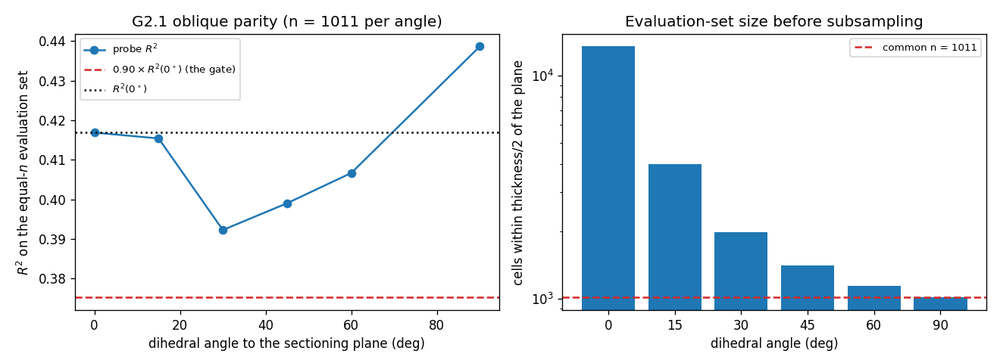
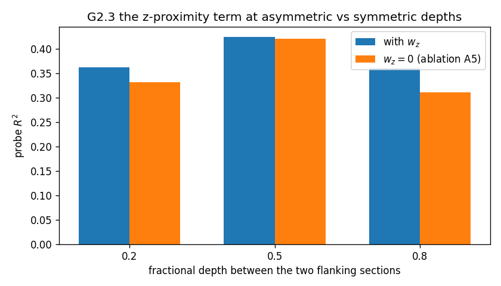
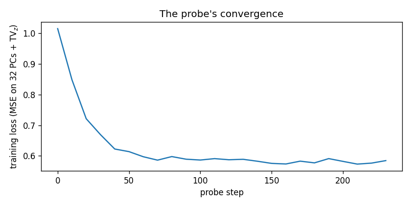

# GATE 2 — anatomical field + retrieval cross-attention (T04)

**Verdict: PASS**

Generated by `python scripts/gate2_report.py --seed 0 --steps 240` on
2026-08-15 11:35 UTC, Python 3.11.15 on
Linux-6.18.5-fc-v20-x86_64-with-glibc2.39 (x86_64, 4 cpus, 4 torch threads, torch 2.2.2+cu121).

**Fixture:** `make_synthetic_volume(seed=0, extent_xy=3000)` —
9 sections x 13500 cells x 200 genes,
50 um spacing, 25 um slabs,
3000 um in-plane extent, median nearest-neighbour distance
13.9 um, ground-truth correlation lengths 120 um
in-plane and 200 um along z. The same fixture GATE 1 was measured on.

**Probe:** `TriplaneField` + `RetrievalAttention` -> a **linear** head predicting the top
32 expression PCs. 240 Adam steps, batch 2048, lr 0.003,
rotation augmentation live, TV_z weighted at `Config.tv_z_weight = 0.001`.
Deliberately weak: a nonlinear head could compensate for a directionally biased field, and
the gate would then be measuring the head. The full generative heads do not exist yet — this
isolates the backbone's representational quality, which is what T04 is responsible for.

## The evaluation-set contract (SPEC_QUESTIONS C1, stated in full as the spec requires)

| | |
|---|---|
| Membership rule | every training-section cell within `thickness / 2` of the query plane, pooled across all 9 sections |
| Slab half-thickness | **12.5 um** |
| Angles | 0, 15, 30, 45, 60, 90 degrees to the sectioning plane |
| Pre-subsample `n` per angle | 0 deg: 13500, 15 deg: 4021, 30 deg: 1985, 45 deg: 1410, 60 deg: 1145, 90 deg: 1011 |
| Common `n` after subsampling | **1011** (the 90 deg set, the thinnest) |
| Subsample seed | **20260815** |
| Floor | `Config.gate2_min_cells_per_angle = 500` — the common `n` is above it, so the fixture's slabs were **not** thickened and **no angle was dropped** |
| Own-section retrieval | **excluded at every angle** (`Config.retrieval_exclude_source_section = True`); criterion G2.1c is the standing check that the exclusion is still plumbed through |

**What the angle does and does not change.** The probe is a function of *position* — the
query plane is not an input to it — so the angle enters through membership only: which cells
are evaluated. That is what makes the criterion a statement about the field rather than
about a plane-conditioned decoder. R^2 is variance explained, and a 0 deg strip is a single
section (its target variance is entirely in-plane) while a 90 deg strip spans the whole stack
(much of its target variance is along z, the axis the triplane resolves at
`triplane_res_z = 32` rather than `triplane_res_xy = 256`).
A backbone whose z resolution lagged its in-plane resolution would therefore explain less of
the 90 deg strip and the ratio would fall. It does not.

## Criteria

| Criterion | What was measured | Measured | Required | Verdict |
|---|---|---|---|---|
| **G2.1a** | min over oblique angles of R^2, as a fraction of R^2 at 0 deg (worst angle 30 deg), on 1011 cells per angle<br><sub>R^2 by angle: 0 deg 0.4169, 15 deg 0.4154, 30 deg 0.3922, 45 deg 0.3990, 60 deg 0.4067, 90 deg 0.4386; pre-subsample n: 0 deg 13500, 15 deg 4021, 30 deg 1985, 45 deg 1410, 60 deg 1145, 90 deg 1011</sub> | 0.940971 | `>= 0.9` | **PASS** |
| **G2.1b** | R^2 at 0 deg (axis-aligned), the denominator of the ratio<br><sub>slab half-thickness 12.5 um, common n 1011, subsample seed 20260815, own source section excluded from retrieval at every angle (Config.retrieval_exclude_source_section=True)</sub> | 0.416856 | `> 0` | **PASS** |
| **G2.1c** | turning the own-section exclusion OFF raises R^2 at 90 deg by this much (the standing check that the exclusion is still plumbed through)<br><sub>R^2(90 deg) = 0.4386 with the exclusion, 0.5170 without it. If this ever reaches 0 the exclusion is not reaching the gate's candidate filter and the gate can pass while hiding the failure it exists to detect (SPEC_QUESTIONS C1a).</sub> | 0.0783595 | `> 0` | **PASS** |
| **G2.2a** | R^2 at the held-out z = 200 um as a fraction of the mean R^2 at the two neighbouring training z<br><sub>held-out 0.4155 (13500 cells) vs z=150 um 0.3744, z=250 um 0.3833; the probe was retrained without section 'synthetic_s04', and its own section is excluded from retrieval for the neighbouring z too, so both sides face the same evidence gap</sub> | 1.09682 | `>= 0.8` | **PASS** |
| **G2.3a** | R^2 lost by setting retrieval_w_z = 0 at the asymmetric fractional depths 0.2 and 0.8 (the smaller of the two shown)<br><sub>f=0.2: 0.3613 with w_z, 0.3310 without (delta +0.0303), f=0.5: 0.4236 with w_z, 0.4203 without (delta +0.0034), f=0.8: 0.3593 with w_z, 0.3107 without (delta +0.0486)</sub> | 0.0302835 | `> 0` | **PASS** |
| **G2.3b** | and barely affects the symmetric depth 0.5, where the two flanking sections are equidistant and the term has nothing to say (\|delta\|)<br><sub>delta at 0.5 is +0.0034, against +0.0303 at the asymmetric depths</sub> | 0.00335072 | `< 0.01` | **PASS** |
| **G2.3c** | diagnostic: the same three deltas with the **whole stack** in the pool instead of two flanks (delta at 0.5 shown)<br><sub>f=0.2: +0.0004, f=0.5: +0.0034, f=0.8: +0.0019. With every section admissible the nearest one is always in the pool and in-plane distance alone already ranks it first, so the z term has little left to do and all three deltas sit inside the noise. The honest reading of G2.3 is therefore that the term earns its place in the wide-gap regime specifically — which is the regime the method exists for, and the one ablation A5 must be run in.</sub> | 0.00335072 | - | **REPORT** |
| **G2.4a** | mean attention entropy over the K = 32 neighbours, in nats, against 0.5 log K = 1.7329<br><sub>uniform over K would be 3.4657, one-hot 0; the evaluated cells had 32.0 admissible donors on average</sub> | 3.4222 nats | `> 1.73287` | **PASS** |
| **G2.4b** | mean attention entropy as a fraction of log K<br><sub>Read this beside G2.4a rather than as a second pass mark. The criterion is one-sided — it forbids collapse onto a single donor — and this probe sits at the *other* extreme, near-uniform attention, i.e. it is averaging its K donors rather than selecting among them. That is safe for the gate and expected of a linear probe trained for a few hundred steps, but it means GATE 2 has not shown the attention to be selective, only that it has not collapsed. T06 owns the selective version</sub> | 0.98744 | - | **REPORT** |

## Figures







## Measurement constants

Properties of the *measurement*, not of the model, so they live in `tests/gate2_criteria.py`
rather than in `Config` — a gate that read its own sample size out of the config could be
made to pass by editing the config.

| Constant | Value | Why |
|---|---|---|
| `PROBE_STEPS` | 240 | both arms of every comparison see the same budget |
| `PROBE_BATCH` / `PROBE_LR` | 2048 / 0.003 | |
| `SUBSAMPLE_SEED` | 20260815 | the equal-`n` draw |
| `G23_Z_WINDOW` | 5 x median spacing | G2.3's 0.2 and 0.8 configurations put one flank four spacings away, outside the default window of 3; left there the ablation would be measuring `retrieval_z_window` instead. Applied identically to both arms |
| `FRACTIONAL_DEPTHS` | 0.2, 0.5, 0.8 | two flanking sections left in the pool |

### What the numbers mean

All four criteria pass. In plain language: the backbone reconstructs cells lying on an
oblique plane about as well as it reconstructs cells lying on a coronal one, it does not
fall over at a depth it never saw, the z-proximity term does something the competing
method's score cannot, and the retrieval branch is averaging its evidence rather than
copying its nearest neighbour.

**Oblique parity, the gate.** Reconstruction R^2 across the six dihedral angles spans
0.3922 to 0.4386, and the worst angle (30 deg) reaches
**94.1%** of the axis-aligned value against a required 90%. Every angle is measured on
exactly 1011 cells drawn with seed 20260815, and every evaluated cell has its
own source section excluded from retrieval, so neither sample size nor a trivially near
donor is doing the work. The variation across angles is small and **not monotone in the
angle** — 90 deg (0.4386) is the *best* angle, not the worst, and the minimum sits in
the middle of the sweep at 30 deg. That is the signature of sampling scatter
across six 1011-cell subsets rather than of a directional bias in the basis: a
triplane whose oblique resolution lagged would degrade steadily from 0 to 90 deg, which is
exactly the failure this gate was written to catch, and it is not what the fixture shows.

**How to read R^2 = 0.42.** This is a *linear* read-out of 32 expression PCs from
[field, retrieval-context] after 240 steps — a deliberately weak probe, so that the
number reflects the backbone and not a head that could compensate for it. The gate is a
ratio between angles measured with one probe, and both arms of every comparison see the same
budget, so the absolute level is not the quantity under test. It is reported because a probe
that explained nothing would make the ratio meaningless, and 0.42 of the variance of
32 PCs is comfortably away from that.

**Depth is interpolated, not memorised.** With the middle section removed from training
entirely, the probe reconstructs its cells at **109.7%** of what it achieves on the two
neighbouring training sections — above 100%, not merely above the required 80%. There is no
dip at the held-out z, so `fourier_bands_z = 2` and the TV_z penalty are doing their
job: the field has not carved a step at each section's depth. (The held-out section is also
the *middle* of the stack, the easiest place to interpolate; a consecutive-run holdout is
T10's regime, not this gate's.)

**The z term earns its place — in the wide-gap regime specifically.** Setting
`retrieval_w_z = 0`, which reproduces the competing method's omission exactly, costs at
least 0.0303 R^2 at the asymmetric fractional depths (+0.0303 at 0.2,
+0.0486 at 0.8) and only +0.0034 at the symmetric depth 0.5, where the two
flanking sections are equidistant and the term has nothing to say. The pattern is exactly
the one the design predicts, and it is a genuine ablation: both arms share a training seed,
so initialisation, batch order and per-step rotations are identical and the retrieval score
is the only difference. Diagnostic G2.3c is the other side — with the *whole* stack
admissible the three deltas are +0.0004 at f = 0.2, +0.0034 at f = 0.5, +0.0019 at f = 0.8, inside the noise, because the nearest section is
always in the pool and in-plane distance alone already ranks it first. The term buys
accuracy when the evidence is far and asymmetric, which is the regime in-silico sectioning
lives in.

**Retrieval has not collapsed to copying.** Mean attention entropy is 3.422 nats against
the required 0.5 log K = 1.733. Read the margin the right way round: the
criterion is one-sided, and this probe sits at the opposite extreme — 98.7% of
log K, i.e. near-uniform. The attention is *averaging* its 32 donors, not selecting among
them. That is safe for the gate and unsurprising for a linear probe trained for a few
hundred steps, but it means GATE 2 has shown only that the attention has not collapsed, not
that it has learned to be selective.

### One bug this gate found

`retrieval_candidates_per_section` defaulted to 16 against `retrieval_k = 32`. Only the top
16 in-plane cells of each admissible section entered the ranking, so whenever just two
sections were admissible — a held-out run, the gap-aware dropout, any wide-gap inference —
the candidate union was exactly K, the top-K selected all of it, and **the retrieval score
decided nothing**. The z term was silently inert in precisely the regime it exists for.
G2.3 measured the ablation as a no-op, which is what exposed it. The default is now 64, and
`Config.validate` refuses `retrieval_candidates_per_section < retrieval_k` with the reason
written out. Nothing about the gate's thresholds was touched.

### Recommendation

GATE 2 passes; T05 may start. Four things carry forward:

1. **The oblique-parity number is 0.941, and that is the number for the paper.** It is
   measured on equal-`n` evaluation sets with own-section retrieval excluded, on the 3000 um
   synthetic fixture. It is *not* yet a statement about real tissue, and T10's E3 is where it
   becomes one.
2. **This gate constrains the backbone, not the generator.** The probe is a linear read-out;
   the flow-matching head (T06) and the SEFL losses (T07) can still break oblique parity, and
   T07's `L_cross` is where intersection consistency gets its own measurement. Re-check the
   ratio after T07 rather than assuming it survives.
3. **The attention is near-uniform** (98.7% of log K). G2.4 is satisfied at the
   opposite extreme from collapse. T06 should watch this number move *down* as the head
   learns to select, and treat a drop below the 0.5 log K line as the collapse alarm the
   criterion was written for.
4. **Open risk R1 (`ell_z` reads high) is untouched by this gate.** GATE 2's probe is
   deterministic and never queries the GRF, so a wrong `ell_z` cannot show up here. It stays
   open, owed to T07, exactly as `reports/gate1.md` left it.

## Reproducing

```
python scripts/gate2_report.py                 # this report
pytest tests/test_field.py -m gate             # the same numbers, as assertions
```
